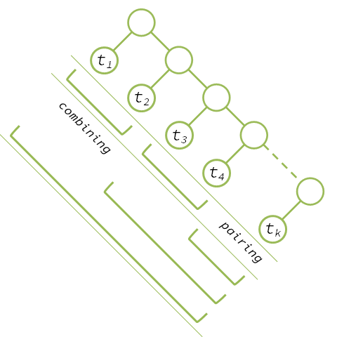
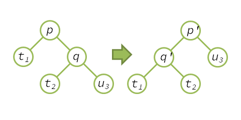
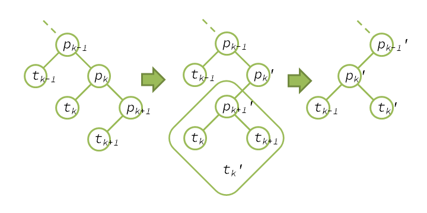

Conider merge operation divided to the pairing step and the combining step.

## Pairing

On pairing, the amortized cost of one merge operation is
$$
A(p) = 1 + \Phi(p') - \Phi(p)
$$
$$
= 1 + \phi(p') + \phi(q') - \phi(p) - \phi(q)
$$
$$
= 1 + \phi(q') - \phi(q)
$$
$$
= 1 + \log(\#t_1 + \#t_2) - \log(\#t_2 + \#u_3)
$$
$$
\le 1 + \log(\#t_1 + \#t_2) - \log(\#u_3)
$$
As $2 + \log(\#t_1 + \#t_2) + \log(\#u_3) \le 2\log(\#t_1 + \#t_2 + \#u_3)$ (See appendix),
$$
\le 2\log(\#t_1 + \#t_2 + \#u_3) - 2\log(\#u_3) - 1
$$
$$
\le 2\log(\#u_1) - 2\log(\#u_3) - 1
$$
If we let the number of the pairs as $p$, the total amortized cost on pairing is
$$
\sum_{i=1}^{p} (2\log(\#u_{2i-1}) - 2\log(\#u_{2i+1}) - 1) = 2\log(\#u_1) - 2\log(\#u_{2p+1}) - p
$$
$$
\le 2\log(\#u_1) -p = 2\log(n) - p
$$

## Combining

On combining, the amortized cost of merging is as follows.
$$
A(p) = 1 + \Phi(p_k') - \Phi(p_k)
$$
$$
= 1 + \phi(p_k') + \phi(p_{k+1}') - \phi(p_k) - \phi(p_{k+1})
$$
$$
= 1 + \log(\#t_k + \#t_{k+1} + 1) + \log(\#t_k + \#t_{k+1}) - \log(\#t_k + \#t_{k+1} + 1) - \log(\#t_{k+1} + 1)
$$
$$
< 1 + \log(\#t_k + \#t_{k+1} + 1) - \log(\#t_{k+1} + 1)
$$
$$
= 1 + \log(\#t_k' + 1) - \log(\#t_{k+1} + 1)
$$
So, if we let th number of combining as $c$, the total amortized cost is
$$
\sum_{i=1}^{c} (1 + \log(\#t_i '+ 1) - \log(\#t_{i+1})) = c + \log(\#t_1' + 1) - \log(\#t_{c+1})
$$
$$
\le c + \log(\#t_1 + 1) = c + \log(n)
$$

## deleteMin and Merge
For $c = p-1$ or $c = p$, $c \le p$. So the total amortized cost of `merge` is
$$
A_{merge} = (2\log(n) - p) + (c + \log(n)) \le 3\log(n)
$$

About `deleteMin`, cosidering the decrease of potential for removing the minimum node($\log(n+1)$), 
the amortized cost is as follows.
$$
A_{deleteMin} < 2\log(n)
$$
After all, it consists both `merge` and `deleteMin` run in $O(log(n))$.

## Appendix
For positive number $x, y$,
$$
0 \le (x-y)^2
$$
$$
4xy \le (x+y)^2
$$
$$
2 + \log(x) + \log(y) \le 2\log(x+y)
$$
