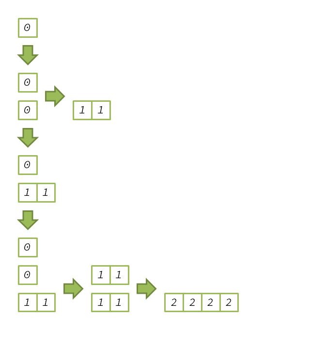

サイズ$2^k$のセグメントに属する要素は$d = k$の負債を負うとする。
このセグメントがマージされるのは$2^k$回`add`が呼ばれた後なので、1回の`add`で$k$の負債を返却すれば、このセグメントの負債は完済される。
他のセグメントについても同様で、サイズ$2^m-1 \le n < 2^m$のコレクションについて、1回の`add`で返済すべき負債の合計は最大で

$$
\sum_{k=0}^{m-1}2^k k = 2^m(m-2)+1
$$

よって`add`は$O(n\log n)$の償却計算量となる。

`sort`については、物理学者法と同様。（それ以外の方法が分からない・・・）