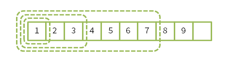

# Exercise 7.1

`snoc`、`head`、`tail` いずれの関数も、引数のパターンマッチあるいは `check` 関数の呼び出し時に、依存している停止計算を進行させる（以前に生成された `rotate` 関数を呼び出す）可能性がある。
この呼び出しは再帰的に複数回実行されうるが、簡単のため `rotate` 関数の呼び出しが遅延されるものとすると、 $|ys| = |xs| + 1$ の条件を満たすことから、1回の呼び出しごとに引数のストリームのサイズは1/2未満となる。
したがって、`rotate` 関数の呼び出しは $O(\log n)$ となる。
その他の操作はすべて $O(1)$ なので、各関数の最悪ケースの実行時間は $O(\log n)$ である。

なお `snoc` について、実際には最低1回（＋依存している停止計算分）の `rotate` 関数呼び出しが発生するが、`rotate` 関数呼び出しが遅延されると仮定すると、$O(1)$ になると思われる。
